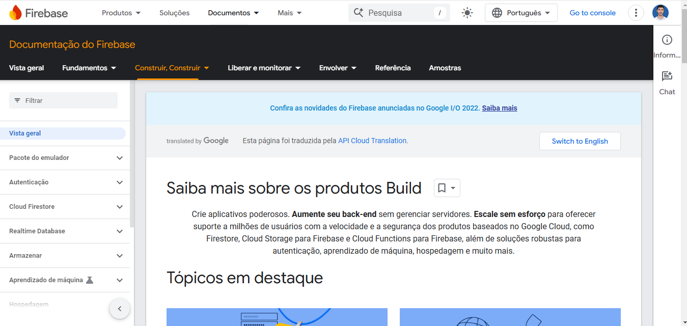

# Firebase

# Menu

1. [O Firebase](#o-firebase)
2. [Recursos](#recursos)
3. [Quando usar o Firebase?](#quando-usar-o-firebase)
4. [Quando não usar o Firebase?](#quando-não-usar-o-firebase)
5. [Como o Firebase Funciona?](#como-o-firebase-funciona)
6. [Vantagens do Firebase](#vantagens-do-firebase)
7. [Desvantagens do Firebase](#desvantagens-do-firebase)
8. [Minhas notas](#minhas-notas)

# O Firebase

É uma plataforma de desenvolvimento de aplicativos desenvolvida pelo Google, que fornece uma variedade de ferramentas e serviços para facilitar a criação, integração e manutenção de aplicações web e móveis. É amplamente utilizado para gerenciar funcionalidades de backend como autenticação, banco de dados, armazenamento de arquivos, análise de dados e muito mais.

## Recursos

| Serviço                    | Descrição                                                                                                 |
| -------------------------- | --------------------------------------------------------------------------------------------------------- |
| **Authentication**         | Fornece métodos fáceis para autenticação de usuários com e-mail/senha, Google, Facebook e mais.           |
| **Firestore**              | Banco de dados NoSQL flexível e escalável, otimizado para consultas em documentos e coleções.             |
| **Realtime Database**      | Banco de dados em tempo real que sincroniza instantaneamente os dados entre clientes.                     |
| **Storage**                | Armazenamento de arquivos como imagens e vídeos com segurança baseada em autenticação.                    |
| **Hosting**                | Hospedagem rápida e segura para aplicativos web estáticos com suporte para HTTPS e CDN.                   |
| **Cloud Functions**        | Executa código backend em resposta a eventos sem a necessidade de gerenciar servidores.                   |
| **Firebase Analytics**     | Ferramenta de análise de dados que fornece insights detalhados sobre o comportamento do usuário.          |
| **Cloud Messaging (FCM)**  | Envia notificações push e mensagens em tempo real para dispositivos móveis e aplicativos web.             |
| **Crashlytics**            | Monitoramento de falhas em tempo real para identificar e resolver problemas de estabilidade.              |
| **Remote Config**          | Permite alterar a aparência e o comportamento do aplicativo sem precisar de uma nova versão.              |
| **App Distribution**       | Distribuição fácil de versões de teste do app para testadores e coleta de feedback.                       |
| **Performance Monitoring** | Análise de desempenho do app em tempo real, com métricas para tempo de carregamento e renderização.       |
| **Test Lab**               | Plataforma para testar apps automaticamente em dispositivos físicos e virtuais.                           |
| **In-App Messaging**       | Envia mensagens direcionadas dentro do aplicativo para engajar os usuários ativos.                        |
| **Dynamic Links**          | Links que mantêm contexto e informações ao navegar entre diferentes plataformas e dispositivos.           |
| **Machine Learning**       | SDK de ML com recursos de visão computacional, tradução de texto e outras funções baseadas em IA.         |
| **Extensions**             | Conjunto de funções pré-configuradas que adicionam recursos como processamento de imagens, e-mail e mais. |

## Quando usar o Firebase?

1. **Prototipagem rápida:** O Firebase é ideal para começar rapidamente, pois fornece várias ferramentas que já estão integradas e prontas para uso.
2. **Aplicativos em tempo real**: Com o Realtime Database e Firestore, você pode construir facilmente aplicativos colaborativos, como chats e painéis de controle.
3. **Gerenciamento de usuários e segurança**: O Firebase Authentication e o Firebase Security Rules ajudam a lidar com autenticação e proteção de dados de maneira simples.
4. **Pequenos e médios projetos**: É excelente para startups e pequenas empresas devido à fácil configuração e plano gratuito (Firebase Spark Plan).

## Quando não usar o Firebase?

1. **Aplicações grandes e complexas**: Se você precisa de um controle mais detalhado do backend, como bancos de dados relacionais ou integrações complexas, outras soluções como PostgreSQL ou MongoDB podem ser mais adequadas.
2. **Quando há grande dependência de operações complexas no servidor**: Firebase Functions é limitada em alguns aspectos quando comparada a um backend dedicado e robusto.
3. **Questões de Custo**: À medida que o uso aumenta, os custos podem se tornar altos. Portanto, é importante monitorar e estimar o uso futuro.

## Como o Firebase Funciona?

- O Firebase utiliza um modelo de dados NoSQL e permite que você defina regras de segurança e políticas de acesso usando Firebase Security Rules.
- O Realtime Database e o Firestore oferecem sincronização em tempo real entre todos os dispositivos conectados, garantindo que as mudanças sejam instantaneamente refletidas.
- Todos os serviços são gerenciados na Firebase Console, uma interface gráfica que permite o gerenciamento de todos os recursos e facilita a integração com SDKs para web, Android e iOS.

## Vantagens do Firebase

1. **Facilidade de integração**: Os SDKs do Firebase facilitam a conexão com diferentes serviços e recursos.
2. **Escalabilidade**: É possível escalar facilmente conforme o número de usuários cresce.
3. **Plataforma única**: Combina múltiplas ferramentas em um só lugar, simplificando o desenvolvimento e gerenciamento.

## Desvantagens do Firebase

1. **Dependência de plataforma**: Por ser um serviço gerenciado pelo Google, há um certo grau de dependência na infraestrutura.
2. **Limitações em consultas complexas**: Consultas muito avançadas podem ser complicadas de implementar ou ter performance limitada.
3. **Custo crescente**: Embora comece gratuito, o custo aumenta rapidamente com o uso intensivo de dados, autenticação e funções.

## Sobre o curso

Este curso é ministrado pelo professor **Augusto Crummenauer** e dividido nas seguintes seções:

- [x] **Seção 1**: [Introdução ao nosso curso sobre Google Firebase](#introdução-ao-nosso-curso-sobre-google-firebase)
- [x] **Seção 2**: [Definindo interface de usuário inicial](#seção-2-definindo-interface-de-usuário-inicial)
- [ ] **Seção 3**: [Autenticando e gerenciando usuários com o Firebase Authentication](#seção-3-autenticando-e-gerenciando-usuários-com-o-firebase-authentication)
- [ ] **Seção 4**: [Hospedando a primeira versão da aplicação](#seção-4-hospedando-a-primeira-versão-da-aplicação)
- [ ] **Seção 5**: [Persistindo dados no Realtime Database do Firebase (CRUD)](#seção-5-persistindo-dados-no-realtime-database-do-firebase-crud)
- [ ] **Seção 6**: [Gerenciando arquivos no Cloud Storage de Firebase](#seção-6-gerenciando-arquivos-no-cloud-storage-de-firebase)
- [ ] **Seção 7**: [Hospedando a segunda versão da aplicação](#seção-7-hospedando-a-segunda-versão-da-aplicação)
- [ ] **Seção 8**: [Persistindo dados no Cloud Firestore do Firebase (CRUD)](#seção-8-persistindo-dados-no-cloud-firestore-do-firebase-crud)
- [ ] **Seção 9**: [Hospedando a terceira versão da aplicação](#seção-9-hospedando-a-terceira-versão-da-aplicação)
- [ ] **Seção 10**: [Finalização do nosso curso](#seção-10-finalização-do-nosso-curso)

## Meu progresso

# Minhas notas

Nesta seção irei adicionar minhas anotações e explicações sobre os produtos que o firebase disponibiliza para o desenvolvimento web.

### **Seção 1:** Introdução ao nosso curso sobre Google Firebase

Neste capitulo o professor faz um breve resumo sobre os recursos e custos do uso do firebase base, o que pode ser lido na seção 1: [O Firebase](#o-firebase) e nas seções subjacentes.

### **Seção 2:** Definindo interface de usuário inicial

Nesta seção damos inicio a construção do nossa primeira aplicação, um **To-do list**, onde construimos a interface do nosso aplicativo usando HTML, CSS e Javascript sem fazer a integração com o Firebase. Ao final do capitulo o frontend da nossa aplicação ficou como mostrado na imagem abaixo.

### **Seção 3**: Autenticando e gerenciando usuários com o Firebase Authentication

Nesta seção vamos criar nosso projeto dentro do firebase e dar inicio a autênticação de usúario.
Ao acessar o site do firebase você deve criar uma conta ou logar com sua conta google, uma vez com sua conta criada, agora precisamos criar um projeto onde adicionaremos nossos aplicativos. Clique no link **Go console** na parte superior
direita do site do firebase.

